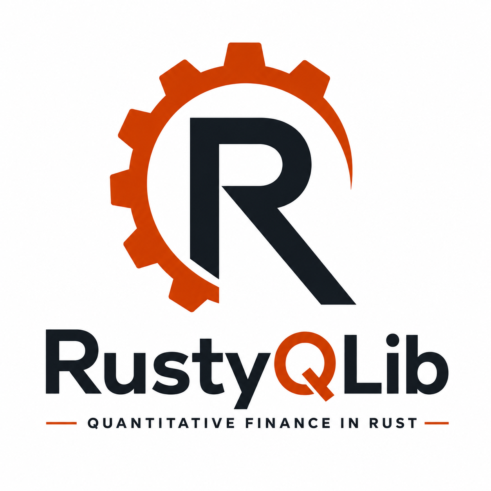

<p align="center">
  
</p>

<h1 align="center">RustyQLib</h1>
<p align="center"><em>Quantitative finance in Rust — price derivatives from JSON, XML, or Rust.</em></p>

<p align="center">
<a href="https://github.com/siddharthqs/RustyQLib/actions/workflows/rust.yml"></a>
<a href="https://opensource.org/licenses/MIT"></a>


<a href="https://codecov.io/gh/siddharthqs/RustyQLib"></a>
</p>

---

A lightweight quantitative finance library written entirely in Rust. Its
numerical core — solvers, optimizers, lattices, PDE grids, FFT, adjoint
differentiation — is written in-crate rather than pulled from a numerics
stack, and the whole library contains **zero `unsafe`**. Use it as a stateless
pricing service in a single binary, or as a library.

Every pricer is cross-checked in the test suite against independent oracles,
put-call parity, replication identities and cross-engine agreement.

## Quick start

```bash
cargo add rustyqlib                     # library
cargo install rustyqlib --features cli  # command-line tool
```

```rust
use rustyqlib::equity::builder::EquityOptionBuilder;
use rustyqlib::equity::utils::Engine;
use rustyqlib::core::trade::PutOrCall;
use rustyqlib::Instrument;

// build() validates every input and the engine/payoff combination:
// an option that builds is guaranteed to price
let option = EquityOptionBuilder::new()
    .spot(100.0).strike(100.0)
    .flat_vol(0.30).flat_rate(0.05).dividend_yield(0.02)
    .years_to_maturity(1.0)
    .vanilla(PutOrCall::Call)
    .engine(Engine::FiniteDifference)
    .build()?;

// one call returns value, all Greeks, and (on MC engines) the standard error
let r = option.price()?;
println!("pv {:.6}  delta {:.4}  vega {:.4}", r.pv, r.greeks.delta, r.greeks.vega);
```

## Modules

Each has its own guide:

| Module | Covers |
|---|---|
| **[`src/equity`](src/equity/README.md)** | Equity derivatives — 10 pricing engines, 20+ payoffs, and the volatility model zoo (local vol, Heston, Bates, SABR, SLV, rough Bergomi, SVI/SSVI/eSSVI) |
| **[`src/bonds`](src/bonds/README.md)** | Fixed income — Treasury and corporate bonds, bills, FRNs, futures basis, convertibles, credit, and curve bootstrapping |
| **[`src/rates`](src/rates/README.md)** | Interest rates — swaps, OIS, basis swaps, fed funds and SOFR futures with full leg conventions; multi-curve calibration with market-quote PV01; swaptions and caps/floors under Vasicek / Hull-White with normal and Black vols |
| **[`src/cmdty`](src/cmdty/README.md)** | Commodities — swaps, APOs, spread options, swaptions; Bachelier and shifted-lognormal models for underlyings that print negative |
| **[`src/validation`](src/validation/README.md)** | Model validation — runtime checks that measure model quality on *today's* data, reported in z-scores |

Supporting modules: [`src/core`](src/core) (curves, vol surfaces, day counts,
holiday calendars, solvers, optimizers, AAD, FFT), [`src/risk`](src/risk)
(VaR, Expected Shortfall, stress), [`src/data`](src/data) (free market-data
feeds).

## What's inside

- **10 pricing engines** behind one dispatch — analytic, Black-76, two
  American approximations (BAW, Bjerksund-Stensland), binomial, finite
  difference, Heston ADI, parallel Monte Carlo, COS and Carr-Madan.
- **Eight volatility frameworks** — Black-Scholes, Dupire local vol, Heston,
  Bates (Merton and Kou jumps), SABR, SLV, rough Bergomi, and SVI/SSVI/eSSVI
  parametric surfaces with no-arbitrage checks.
- **20+ payoffs** — vanillas, binaries, all eight barrier types with rebates
  and double-barrier corridors, Asians, lookbacks, choosers, autocallables and
  Phoenix notes, cliquets and Napoleons, accumulators, variance/gamma/corridor
  swaps, and multi-asset rainbows.
- **Market-standard infrastructure** — discount curves (discount factors as
  the source of truth), vol surfaces (strike, moneyness, FX delta), robust
  implied vol, day counts, and holiday calendars with business-day conventions
  and schedule generation.
- **Free market data** — US Treasury par yields, NY Fed SOFR/EFFR, the DTCC
  GCF Repo Index, DTCC public CDS prints, and Cboe delayed option chains.

## Feature flags

The default build is the lean pricing library — no CLI, no XML, ~40% fewer
transitive dependencies.

| Feature | Adds |
|---|---|
| *(default)* | pricing, calibration, risk, JSON contracts |
| `xml` | XML contract input/output |
| `stress-config` | TOML stress-scenario files |
| `fetch` | free official market data |
| `cli` | the `rustyqlib` binary (implies all of the above) |

## CLI

```bash
# price a JSON/XML file, a directory, or stdin
rustyqlib price --input contracts.json --output results.json
cat contracts.json | rustyqlib price -i - | jq '.[].output.pv'

# fetch free market data
rustyqlib fetch ust -o ust.json                       # Treasury par yields
rustyqlib fetch sofr                                  # NY Fed reference rates
rustyqlib fetch gcf --date 2026-08-05                 # DTCC GCF Repo Index
rustyqlib fetch cds --symbol CDX.NA.IG                # DTCC public CDS prints
rustyqlib fetch chain --symbol AAPL --normalize       # Cboe option chain

# chain -> implied vol surface -> Dupire local vol (documents + 3D plots)
rustyqlib fetch chain --symbol AAPL --normalize | rustyqlib build --curve ust.json -i - -o out/

# risk
rustyqlib stress -i portfolio.json -c scenarios.toml
rustyqlib risk -i portfolio.json --confidence 0.99 --horizon-days 1

rustyqlib --help          # full command list
rustyqlib interactive     # guided pricing in the terminal
```

## Performance

Indicative single-threaded figures from `cargo bench` (criterion, fixed seeds):

| Operation | Time |
|---|---|
| Black-Scholes `npv()`, curve and surface lookups included | ~0.7 µs (~1.5M/sec) |
| 20-strike Heston smile, COS | ~1.6 ms (vs ~137 ms per-strike, ~90×) |
| American put, Leisen-Reimer 101 steps | ~26 µs (vs ~2.3 ms on CRR-1000) |

## Documentation

- **[Examples](examples/)** — runnable end-to-end programs, including a real
  Cboe chain → parity forwards → implied surface → local vol → reprice.
- **[docs.rs](https://docs.rs/rustyqlib)** — API documentation.

## License

MIT — see [License](License).
